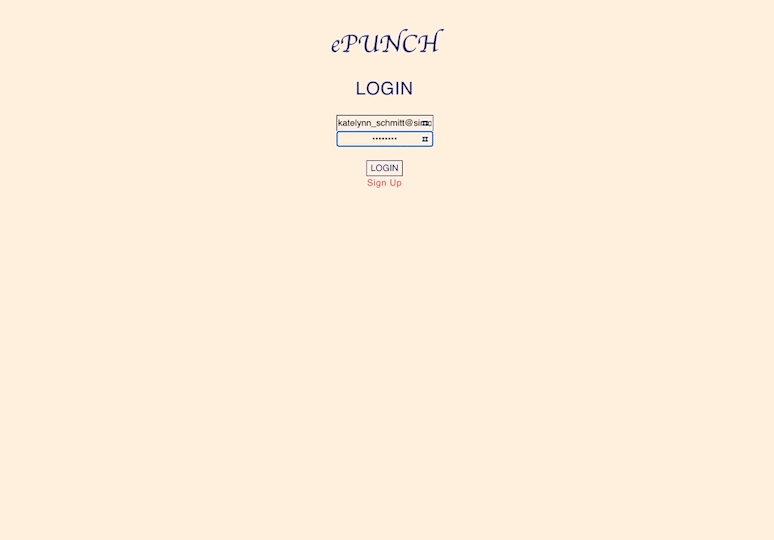

# ePUNCH

## The digital punch card that is always in your pocket.

<br>
<div align="center">

</div>

</div>

<br>

### ePUNCH is an app that allows coffee shops to issue digital punch cards for their customers. In future version of the app customers will also be able to safely log in an have an overview of all their punch cards and their favorite coffee shops.

### In this beta version of the app:

<br/>

### - Coffee shops can sign up and log in with a secure password. And log out.

### - Coffee shops can have a visual overview of all their active punch cards.

### - Coffee shops can also punch the card until they reach the max of 10 punches.

### - Coffee shops can reset the card back to 0 punches.

### - Coffee shops can delete a punch card.

### - Coffee shops can look their profile and update any field.

### - Coffee shops can issue a new card to any ePUNCH customer. The issued card will automatically be associated with the issuing coffee shop.

<br/>

## Installation

You can use the following commands to run the application:

```ruby
$ git clone
$ bundle install
$ npm install
$ rails db:migrate
$ rails db:seed
$ rails s
$ npm start --prefix client
```

Open Chrome browser, and redirect to 'http://localhost:4000' to start the app.
<br/>
The backend will be running at 'http://localhost:3000'

**Alternatively, it is fully deployed on Heroku!**
<br>
<a href="https://mighty-waters-69972.herokuapp.com/">ePunch</a>

<br/>

## Stack

- [x] Active Record
- [x] Rails
- [x] Bcrypt
- [x] PostgreSQL
